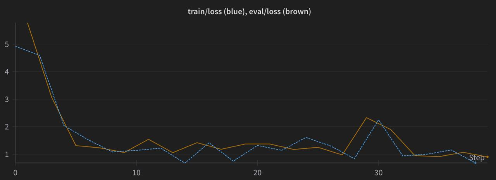

# Fine-Tuning StarCoderbase-1B with LoRA and FIM

This repository contains code and configuration details for fine-tuning the [bigcode/starcoderbase-1b](https://huggingface.co/bigcode/starcoderbase-1b) model using Parameter-Efficient Fine-Tuning (PEFT) with LoRA, Fill-in-the-Middle (FIM) augmentation, and 4-bit quantized training.

The fine tuning is done on the scilit-learn Python library on the task of code completion.

This repository includes:
- ```scripts``` folder with scripts for data scrapping and model fine tuning
- ```cleaned_dataset.jsonl``` the dataset
- ```loss.jpg``` the training and validation losses

## Setup

### Model & Tokenizer

- **Model**: `bigcode/starcoderbase-1b`
- **Tokenizer**: Loaded via Hugging Face Transformers with the padding token set to the EOS token:
  ```
  tokenizer = AutoTokenizer.from_pretrained("bigcode/starcoderbase-1b")
  tokenizer.pad_token = tokenizer.eos_token
  ```

### Data preparation

### Input format
Each data sample should be a dictionary with:
  ```
{ 
  "prompt": "Runs a single iteration of isotonic regression on the input data,\nand reports the total time taken (in seconds).'", 
  "completion": "def bench_isotonic_regression(Y):\n    \n    gc.collect()\n\n    tstart = default_timer()\n    isotonic_regression(Y)\n    return default_timer() - tstart" 
}
  ```

### Tokenization
Before tokenization, prompt and completion part were concatenated. As the task is language modeling, the 'input_ids' duplicate the 'labels'.
Format:  ```{"input_ids": input_ids, "labels": labels} ```

### Streaming Dataset
A custom IterableDataset is used for:

- On-the-fly tokenization
- Optional FIM augmentation
- Streaming into constant-length chunks

## Training configuration

```
from peft import LoraConfig

lora_config = LoraConfig(
    r=8,
    lora_alpha=32,
    target_modules=["c_proj", "c_attn", "q_attn", "c_fc"],
    lora_dropout=0.0,
    bias="none",
    task_type="CAUSAL_LM"
)
```

## Results

The training and validation losses are presented in the Figure:



The training process is quite effective given the limited resources available.

With additional resources, I would prioritize question-answering capabilities based on code snippets, which serves as an effective proxy for assessing an LLM's code comprehension. The dataset could be generated using advanced models like Claude or GPT-4, which my preliminary testing shows produces sufficient quality. The approach would involve fine-tuning models like CodeX or CodeLLama on paired data of code+question and answer.

For evaluating answer accuracy across various valid linguistic expressions, I recommend using Natural Language Inference (NLI) techniques with a lightweight model. This approach would allow us to determine accuracy based on bidirectional entailment between the model's answer and ground truth.

